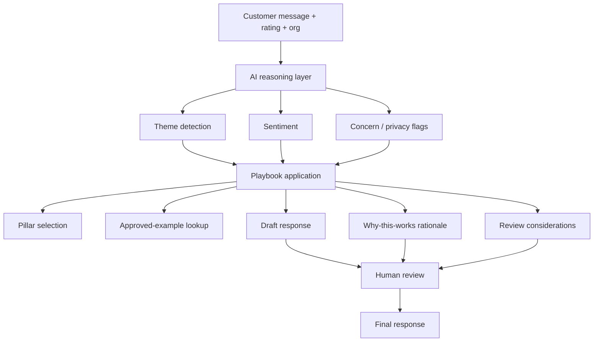
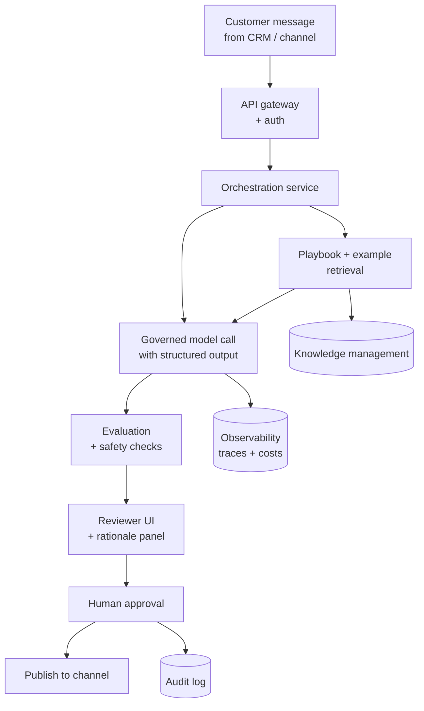

# Architecture

## Current-state architecture

The current implementation is a **client-side React app** with a thin SSR shell. There is no backend, no data storage, no external service, and no live model call.

```
┌──────────────────────────────────────────────────────────────┐
│                        Browser (React)                       │
│                                                              │
│   ┌───────────────┐   ┌──────────────────────┐   ┌────────┐  │
│   │  UI form      │──▶│  generateResponse()  │──▶│  UI    │  │
│   │  (index.tsx)  │   │  (response-generator)│   │  render│  │
│   └───────────────┘   └──────────────────────┘   └────────┘  │
│                              │                                │
│                              ▼                                │
│                    ┌───────────────────┐                      │
│                    │  Encoded playbook │                      │
│                    │  (themes, pillars,│                      │
│                    │  rules, examples) │                      │
│                    └───────────────────┘                      │
└──────────────────────────────────────────────────────────────┘
```

### Implemented workflow (Mermaid)



### Potential production architecture (Mermaid)

> This diagram describes a *possible* production evolution. Nothing below beyond the client-only path above is implemented in this repository today.



## Data flow (current)

1. User selects an organization, enters the customer message, star rating, optional reviewer name, and optional additional context.
2. On submit, the UI calls `generateResponse(input)`.
3. `generateResponse` runs synchronously:
   - `detectThemes(review)` — matches keyword regexes against a fixed `THEME_SIGNALS` list.
   - `detectSentiment(review, stars)` — combines a positive/negative lexicon with the star rating.
   - `selectPillars(themes, stars)` — maps detected themes to messaging pillars.
   - `detectImportantConcern` / `detectPrivacySensitivity` — regex-based flags.
   - `composeResponse(input, themes, pillars)` — deterministic sentence assembly using pillar sentences, opening/closing templates, and length rules keyed to review length + star rating.
   - `whyItWorks` / `reviewConsiderations` / `aiInsight` — plain-English rationale + reviewer-facing flags.
4. The UI renders the draft, rationale bullets, considerations, and any AI insight alongside the input. The user can regenerate (which re-runs with a different rotation seed), copy the draft, or edit it inline before pasting elsewhere.

All of this runs entirely in the browser; nothing is uploaded or stored.

## Current implementation boundaries

- No live LLM call. `generateResponse` is deterministic. The comment at the top of `response-generator.ts` explicitly notes where a live model would slot in.
- No persistence. Refresh loses state.
- No authentication or per-user data.
- No integrations (no CRM read/write, no channel publishing).
- Playbook is baked into the code as typed data — swappable by editing, not by upload.
- The bundled playbook is illustrative (tutoring / education themes). A different domain would need its own theme signals, pillars, rules, and approved examples.

## Human decision points

The UI is designed so a human sees, at minimum, the following before deciding to send a response:

- The draft itself.
- The themes the system detected in the customer message.
- The pillars the system chose to reinforce.
- The considerations the system flagged (privacy, price framing, staff-name rules, tone-for-low-ratings, etc.).
- Optionally, the approved examples the drafting style was informed by.

The human is expected to override any of these based on knowledge the system doesn't have.

## Security and privacy considerations

**Current implementation:**
- No user data leaves the browser.
- No cookies, no analytics, no third-party trackers baked into the app code.
- `noindex,nofollow` on the assistant page (see `src/routes/index.tsx`).
- The public-facing guide page (`/guides/positive-feedback`) is `index,follow`.

**For a production deployment**, additional controls would be required — see [docs/production-roadmap.md](production-roadmap.md).

## Adapting the workflow to another domain

To repoint this workflow at, say, customer support or sales-objection responses, you would replace:

1. `THEME_SIGNALS` in `response-generator.ts` with themes relevant to the new domain.
2. Pillar strings and `pillarSentence` mappings with the new brand-voice pillars.
3. `APPROVED_EXAMPLES` with a small curated set of approved responses in the new voice.
4. Concern / privacy detectors (`detectImportantConcern`, `detectPrivacySensitivity`) with rules specific to the domain's risks.
5. Response-length rules and opening/closing templates as the new channel requires (an email response is not a Google-review reply).
6. UI copy in `src/routes/index.tsx` — labels, empty states, "AI Insight" tone.

The `GeneratorInput` / `GenerationResult` interfaces are stable; changes above are additive within those shapes.
